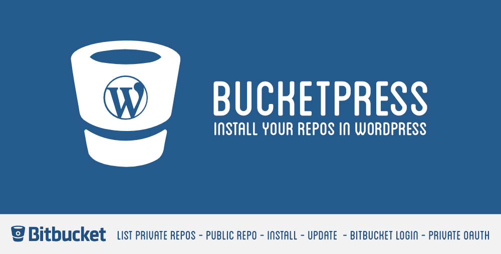

BucketPress
=======

Manage all Bitbucket repositories directly in Wordpress. Select your repositories in the list or add public repositories. Now, you can install or update it directly from your Wordpress admin.